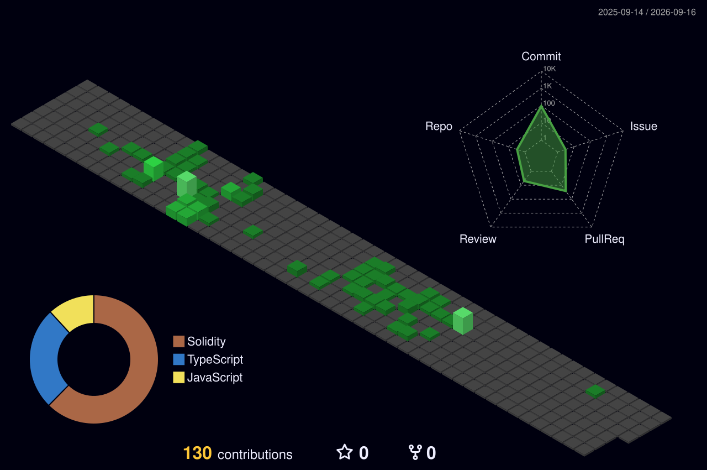

# Galin Petrov

**Fullstack Developer · Web3 Engineer · Sofia, Bulgaria**

---

## About Me

I'm a fullstack developer with 2+ years of professional experience building production-grade web applications and Web3 protocols. I've worked across the stack — from REST APIs and admin dashboards to non-custodial DeFi protocols and blockchain tooling on Hedera.

Currently a **Junior Fullstack Developer at LimeChain**, working on the Hedera ecosystem and DeFi infrastructure. Previously at **Telebid Pro**, where I grew from trainee to junior by shipping real features that reduced operational overhead and expanded platform capabilities.

---

## Tech Stack

**Languages**

**Frameworks & Tools**

---

## Contributions

---

Open to interesting projects and collaborations — <a href="mailto:galinnp@gmail.com">galinnp@gmail.com</a>

